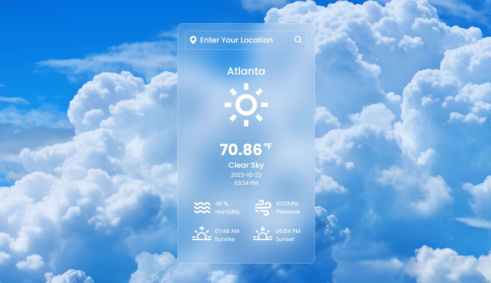

# Weather App with Flask

An application that provides weather information for a specified location using Flask, Python, and the OpenWeatherMap API.

## Table of Contents

- [Introduction](#introduction)
- [Setup](#setup)
- [Usage](#usage)
- [Project Structure](#project-structure)
- [License](#license)

## Introduction

The Weather App is a web application built with Flask that allows users to retrieve weather information for a given location. It uses the OpenWeatherMap API to fetch real-time weather data and displays it to the user.



## Setup

Before running the Weather App, make sure to set up your Python environment and install the required dependencies.

### Installation

1. Install the necessary Python packages using the provided requirements.txt file:

   ```bash
   python -m pip install --upgrade pip
   python -m pip install -r requirements.txt

2. Create a config.json file in the parameters directory and provide your OpenWeatherMap API key as described in the project setup script.
3. Start the Flask application by running:

   ```bash
   python main.py

## Usage

1. Open a web browser and navigate to [http://localhost:5000](http://localhost:5000) to access the Weather App.

2. Enter the location (city) for which you want to retrieve weather information and click the search button.

3. The app will display the current weather conditions, including temperature, description, humidity, and pressure for the specified location.

## Project Structure

The project is organized as follows:

- `main.py`: The main Flask application file.
- `parameters/`: Directory containing the `config.json` file for configuration.
- `static/`: Static files (e.g., CSS and images) for the HTML templates.
- `templates/`: HTML templates for the web pages.
- `README.md`: This project documentation.
- `requirements.txt`: List of Python packages required for the project.
- `setup.py`: Script to set up project directories and configuration.

```
FlaskWeatherApp
├── .idea
│   ├── .gitignore
│   ├── FlaskWeatherApp.iml
│   ├── inspectionProfiles
│   ├── misc.xml
│   ├── modules.xml
│   └── workspace.xml
├── data
├── lib
│   ├── tools.py
│   └── __pycache__
├── LICENSE.txt
├── logs
│   └── Process.log
├── main.py
├── notebooks
│   └── SandBox.ipynb
├── parameters
│   ├── config.json
│   ├── config_template.json
│   └── logs.ini
├── README.md
├── SetUp.py
├── static
│   ├── images
│   └── style.css
├── templates
│   ├── index.html
│   └── template.html
└── venv
    ├── .gitignore
    ├── etc
    ├── Lib
    ├── pyvenv.cfg
    ├── Scripts
    └── share
```    

## License

This project is licensed under the MIT License. See the [LICENSE](LICENSE.txt) file for details.

## Acknowledgments

- Weather data provided by [OpenWeatherMap](https://openweathermap.org).

